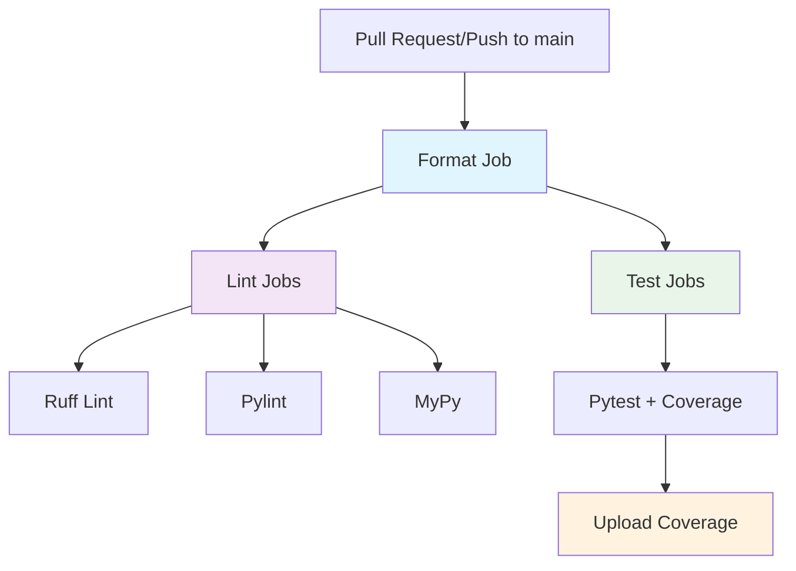
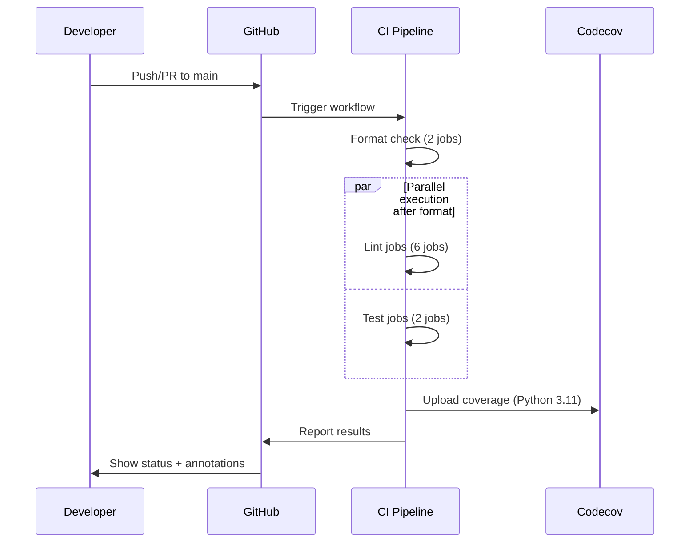

# CI/CD Pipeline Documentation

## Overview

The PopUp-Sim project uses GitHub Actions for continuous integration and deployment. The pipeline ensures code quality through automated formatting, linting, type checking, and testing.

## Workflow Structure



## Jobs Description

### 1. Format Job
**Purpose:** Ensures code formatting consistency across the codebase.

**Matrix:** Python 3.11, 3.12

**Steps:**
- Checkout code
- Setup uv with Python version
- Install dependencies with `uv sync --locked --all-extras --dev`
- Run `ruff format --check --diff .`

**Output:** Shows formatting differences if any exist

### 2. Lint Jobs (Parallel)
**Purpose:** Code quality analysis through multiple linters.

**Matrix:** Python 3.11, 3.12 × 3 linters (ruff, pylint, mypy)

**Dependencies:** Requires format job to pass first

#### Ruff Linting
- **Command:** `uv run ruff check --output-format=github .`
- **Focus:** Code quality, unused imports, simplifications
- **Output:** GitHub annotations on PR lines

#### Pylint
- **Command:** `uv run pylint backend/src/ --output-format=colorized`
- **Focus:** Additional code quality checks
- **Output:** Colorized terminal output

#### MyPy Type Checking
- **Command:** `uv run mypy backend/src/ --show-error-codes`
- **Focus:** Static type analysis
- **Output:** Type errors with specific error codes

### 3. Test Jobs (Parallel)
**Purpose:** Run test suite with coverage reporting.

**Matrix:** Python 3.11, 3.12

**Dependencies:** Requires format job to pass first

**Steps:**
- Run `uv run pytest --tb=short`
- Upload coverage to Codecov (Python 3.11 only)

## Execution Flow



## Configuration Details

### Triggers
- **Pull Requests:** Any PR targeting `main` branch
- **Push Events:** Direct pushes to `main` branch

### Matrix Strategy
- **Python Versions:** 3.11, 3.12
- **Total Jobs:** 10 (2 format + 6 lint + 2 test)

### Dependencies
- Uses `uv.lock` file for reproducible builds
- All jobs use `--locked` flag for consistent dependency versions

### Caching
- uv cache enabled for faster dependency installation
- Automatic caching of Python packages and uv metadata

## Tools Configuration

### Ruff
- **Format:** 120 char lines, single quotes, tabs
- **Lint:** Focus on bugs, unused code, simplifications
- **Output:** GitHub annotations for PR integration

### Pylint
- **Config:** Uses `pyproject.toml` configuration
- **Target:** `backend/src/` directory only
- **Output:** Colorized for better readability

### MyPy
- **Config:** Strict type checking enabled
- **Target:** `backend/src/` and `backend/tests/`
- **Output:** Error codes for easier debugging

### Pytest
- **Config:** Coverage reporting with 90% threshold
- **Output:** Terminal, HTML, and XML reports
- **Upload:** Coverage data sent to Codecov

## Failure Scenarios

### Format Failures
- **Cause:** Code not properly formatted
- **Solution:** Run `uv run ruff format .` locally
- **Impact:** Blocks all other jobs

### Lint Failures
- **Cause:** Code quality issues, type errors
- **Solution:** Fix issues shown in GitHub annotations
- **Impact:** Independent failures, doesn't block tests

### Test Failures
- **Cause:** Failing tests or coverage below 90%
- **Solution:** Fix tests or improve coverage
- **Impact:** Independent of linting jobs

## Local Development

To run the same checks locally:

```bash
# Format check
uv run ruff format --check --diff .

# Linting
uv run ruff check .
uv run pylint backend/src/
uv run mypy backend/src/

# Testing
uv run pytest
```

## Performance Optimization

- **Parallel execution:** Lint and test jobs run simultaneously
- **Matrix optimization:** Each linter runs in separate job for better visibility
- **Caching:** uv cache reduces dependency installation time
- **Locked dependencies:** Faster installs, no resolution needed

## Monitoring

- **GitHub Actions tab:** View detailed logs and job status
- **PR annotations:** Inline code quality feedback
- **Codecov dashboard:** Coverage trends and reports
- **Status checks:** Required checks before merge